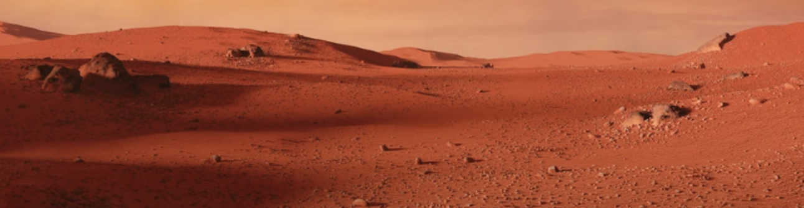

# Cosmo C☄️mpanion
                

  

                                                                                                                    

## Description:

Where are we? We are definitely not on Earth anymore? No fear space cadet, we have Cosmo Companion to assist us on our journey in this brand new undiscovered world! Having a trusty sidekick, like Cosmos Companion, we are able to uncover this new plant and while also cultivate crops.

## Contributors 🛸
- Aadarsh Arasu (aadarsh@bu.edu) 🛰️
- Jilin Zheng (jilin@bu.edu) 🚀
- Shawn Dong (dyst@bu.edu) 🔭
- Dylan Ramdhan (dylram01@bu.edu) 👽

## Resources
https://github.com/Martinsos/arduino-lib-hc-sr04/tree/master